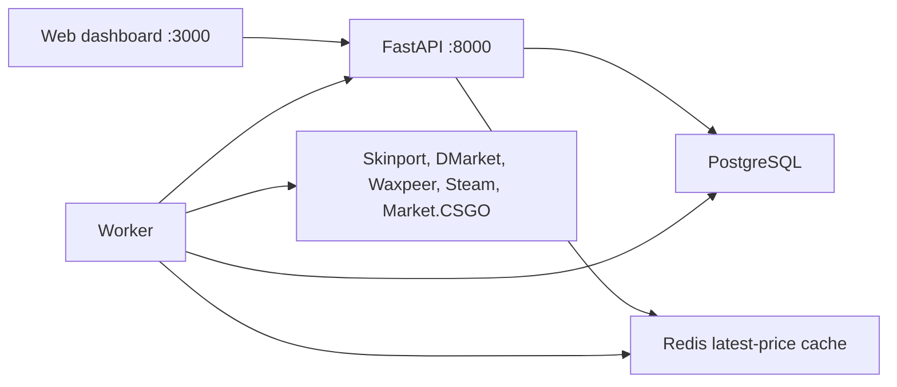

# CS2 Trading Bot

Local desk for CS2 skin traders. It collects asks from several marketplaces, maps them onto one item name, and shows what is left after fees and Steam’s trade lock if you buy on one site and sell on another.

The default mode is **demo**: synthetic prices, no API keys, no network calls to marketplaces. Switch `PARSER_MODE=live` when you want the real public endpoints.

## Architecture



| Piece | Role |
| --- | --- |
| `api` | REST API, JWT auth, OpenAPI at `/docs` |
| `worker` | Polls each enabled marketplace, writes price history, rebuilds spreads |
| `db` | Canonical items, aliases, price history, opportunities, users |
| `redis` | Hot snapshot of the latest ask per item. History always stays in Postgres |
| `web` | React dashboard |

Sell price means the current lowest ask on the destination. Net profit is the spread if you buy that ask on A and relist at B’s current ask. It is not a guaranteed fill.

```
cost     = buy * (1 + buy_fee) + buy * deposit_fee + deposit_flat
proceeds = sell * (1 - sell_fee) - sell * withdraw_fee - withdraw_flat
profit   = proceeds - cost
```

Fees are fractions stored on the marketplace row (`0.12` = 12%). Change them in Admin. They are not hardcoded in the calculator.

A route is **instant** only when the buy marketplace’s `trade_lock_days` is 0. Steam purchases default to 7 days, and Steam sales are marked `cash_out = false` because the money stays in the Steam wallet.

## Marketplaces

All five clients call documented public HTTP APIs. None of them bypass Cloudflare or other bot checks. A challenge page is stored as a failed parser run.

| Slug | Source | Default seller fee | Trade lock | Cash out |
| --- | --- | --- | --- | --- |
| `skinport` | `GET /v1/items` (Brotli, 8 requests / 5 min) | 12% | 0 | yes |
| `dmarket` | Signed `GET /marketplace-api/v2/offers` (`gameId=a8db`, prices in cents, 25 pages) | 7% | 0 | yes |
| `waxpeer` | `GET /v1/prices` asks and `GET /v1/buy-orders/snapshot` highest bid (`1000` = $1) | 2% | 0 | yes |
| `steam` | Community Market search JSON, `currency=1`. Asks only; no bulk buy orders | 13.04% of the buyer price | 7 days | no |
| `market_csgo` | `GET /api/v2/prices/class_instance/USD.json` (`buy_order` is the max bid) | 5% | 7 days | yes |

Buff and CS.MONEY are not included. Buff’s public surface is not a stable official price API, and CS.MONEY does not publish a bulk price feed this client can call without scraping. Add one only if you have a permitted source. See below.

DMarket reads 25 pages (100 offers each) from the signed offers API. Steam stays partial at `max_pages` 2 until a separate decision. Change either cap in the site `config` JSON from Admin.

Confirm every fee on the marketplace before you trade. The numbers above are editable defaults.

## Repository

```
backend/app/main.py                  API entry
backend/app/worker.py                poll loop
backend/app/db/models.py             tables
backend/app/services/normalization.py
backend/app/services/arbitrage.py    net profit
backend/app/services/ingest.py       names, aliases, price rows
backend/app/services/cycle.py        one polling cycle
backend/app/services/parsers/        one module per marketplace
backend/alembic/                     Postgres migrations
frontend/src/                        React dashboard
docker-compose.yml
```

## Run locally

Docker is the supported path.

```bash
cp .env.example .env
# change JWT_SECRET and ADMIN_PASSWORD
docker compose up --build
```

- Dashboard: http://localhost:3000
- API docs: http://localhost:8000/docs
- Health: http://localhost:8000/health

Sign in with `admin@localhost` / `changeme` unless you changed `ADMIN_EMAIL` and `ADMIN_PASSWORD`. The admin user is created once. Changing the password in `.env` later does not reset it.

Demo history is written on first boot when `PARSER_MODE=demo`. The worker appends a new point when the hour changes and the price moved.

### Live prices

```bash
PARSER_MODE=live docker compose up --build
```

Skinport may answer with a Cloudflare challenge from a datacenter IP. The run is marked failed. This project does not try to get around that. Disable the site in Admin or stay on demo mode.

### Without Docker

```bash
cd backend
python -m venv .venv && source .venv/bin/activate
pip install -e ".[dev]"
export DATABASE_URL=sqlite+aiosqlite:///./dev.db
export REDIS_URL=
export PARSER_MODE=demo
export JWT_SECRET=dev
python -m app.seed
uvicorn app.main:app --reload --port 8000
```

```bash
cd frontend
npm install
npm run dev
```

The Vite dev server proxies `/api` to port 8000.

## API examples

```bash
TOKEN=$(curl -s -X POST http://localhost:8000/auth/login \
  -H 'content-type: application/json' \
  -d '{"email":"admin@localhost","password":"changeme"}' | jq -r .access_token)

curl -s -H "Authorization: Bearer $TOKEN" \
  "http://localhost:8000/arbitrage?min_profit_pct=1&instant_only=true&cash_out_only=true"

curl -s -H "Authorization: Bearer $TOKEN" \
  http://localhost:8000/items/1/prices

curl -s -X POST -H "Authorization: Bearer $TOKEN" -H 'content-type: application/json' \
  -d '{"name":"Knives","channel":"telegram","filters":{"min_profit_pct":5,"instant_only":true}}' \
  http://localhost:8000/alerts
```

`POST /alerts` only stores the rule. Telegram and Discord delivery is not implemented.

Interactive docs: http://localhost:8000/docs (`/auth/token` accepts the Swagger password form; the username field is the email).

## Add a marketplace

1. Add `backend/app/services/parsers/<slug>.py` with `fetch` and `search`. Raise `ParserError` on HTTP failures. Do not bypass bot challenges. Aggregate to the cheapest ask.
2. Register the class in `services/parsers/registry.py`.
3. Add a row to `DEFAULT_SITES` in `app/seed.py` with fees, currency, `trade_lock_days`, `cash_out`, and `tos_restricted`.
4. If the site forbids automated access, set `tos_restricted=True` and leave `config.allow_restricted` unset. The worker will refuse to call it until you opt in.
5. Keep API keys in environment variables. `sites.secret_env` may name the variable. The value is never written to the database or returned by the API.
6. Add a mocked response test in `backend/tests/test_parsers.py`.

Names are matched by a normalized market-hash key (weapon, skin, wear, StatTrak, Souvenir). A close spelling is stored as an alias with `needs_review` instead of being merged. Accept or fix it under Admin.

Doppler phases and float values are kept on the price metadata when a feed sends them. They are not separate catalog items.

## Tests and lint

```bash
cd backend && pip install -e ".[dev]" && ruff check . && black --check . && mypy app && pytest
cd frontend && npm ci && npm run lint && npm run build
```

GitHub Actions runs the same checks. Deploy on push to `main` runs only when `DEPLOY_HOST`, `DEPLOY_USER`, `DEPLOY_SSH_KEY`, and `DEPLOY_PATH` are set. It pulls the repo on the server and runs `docker compose up -d --build`.

## Assumptions

- The market page compares highest buy orders. Waxpeer and Market.CSGO publish them. Skinport and the Steam search feed do not, so those sites stay out of the comparison. DMarket's `orderBestPrice` needs signed API keys and is not polled yet.
- Arbitrage still buys the cheapest ask and values the sale at the destination's cheapest ask. That figure is a relist spread, not a filled bid.
- Flat fees are USD. Percent fees apply to the USD price.
- FX rates live in `fx_rates` and start as rough placeholders (EUR, GBP, CNY, RUB). Update them with `PUT /admin/fx/{currency}` before trusting a non-USD feed.
- Opportunities below `ARB_MIN_STORE_PCT` (default `0`) are not stored, so the table stays limited to non-negative spreads.
